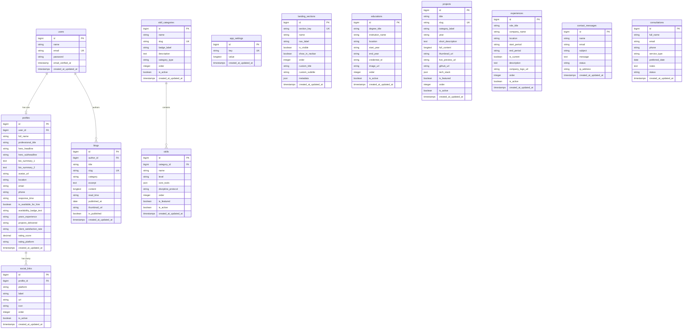

# Laporan Analisis Konten Portofolio & Perancangan Skema Database (Database Design Report)

Dokumen ini memuat analisis mendalam terhadap konten tekstual, komponen, formulir, dan konteks data dari file template portofolio (`d:/tmp/myporto/documents/teemplate-portofolio/index.html`), serta pemetaannya ke arsitektur database Laravel (`d:/tmp/myporto/database`) yang terintegrasi dengan Dashboard CMS (`AppSidebar.vue`).

---

## 1. Eksekutif Ringkasan & Konteks Sistem

### 1.1. Latar Belakang & Tujuan
Template portofolio publik (`index.html`) menampilkan portofolio seorang *Full Stack Software Engineer* (FatzDev) dengan desain modern, tipografi kurasi, dan struktur informasi profesional. Di sisi lain, aplikasi manajemen portofolio dibangun di atas Laravel 11 + Vue 3 (Inertia.js) pada folder `d:/tmp/myporto`. 

Untuk membuat seluruh teks, gambar, tautan, statistik, artikel, riwayat karier, formulir interaktif, serta **visibilitas seksi landing page (On/Off atau Hide/Unhide)** dapat dikelola secara dinamis melalui Dashboard Admin, diperlukan perancangan skema database relasional yang rapi, normal, mudah dikembangkan, dan aman.

### 1.2. Korelasi Menu Dashboard Admin (`AppSidebar.vue`) ke Domain Data
Struktur menu sidebar admin pada `d:/tmp/myporto/resources/js/components/AppSidebar.vue` secara presisi memetakan entitas data berikut:

| Menu Sidebar Admin | URL Route | Icon | Entitas Domain / Tabel Terkait | Konteks Bagian di `index.html` & Deskripsi |
| :--- | :--- | :--- | :--- | :--- |
| **Dashboard** | `/dashboard` | `LayoutGrid` | Agregasi / Metric Counters | Ringkasan statistik, pesan baru, konsultasi pending |
| **Biodata** | `/biodata` | `User` | `profiles`, `social_links` | Bagian `#home` (Hero) & `#about` (Tentang Saya & Metrik) |
| **Skill** | `/skills` | `Code2` | `skills`, `skill_categories` | Bagian `#skills` (Frontend, Backend, DevOps, Philosophy) |
| **Education** | `/educations` | `GraduationCap`| `educations` | Bagian `#education` (Pendidikan formal & sertifikasi) |
| **Project** | `/project` | `Briefcase` | `projects` | Bagian `#portfolio` (Karya terpilih, teknologi, studi kasus) |
| **Experience** | `/experience` | `Paperclip` | `experiences` | Bagian `#experience` (Riwayat karier & perusahaan) |
| **Blog** | `/blog` | `FileText` | `blogs` / `articles` | Bagian `#blog` (Artikel, kategori, estimasi baca) |
| **Contact** | `/contact` | `PhoneCall` | `contact_messages`, `consultations` | Bagian `#contact` (Form pesan & form booking discovery call) |
| **Security & Face ID** | `/settings/security`| `ShieldCheck` | `users`, `app_settings` | Konfigurasi biometrik wajah & keamanan login admin |
| **Control Pages** | `/control-pages` | `EyeOff` | `landing_sections` *(Opsi tabel baru)* & `app_settings` | **Kontrol visibilitas (Hide/Unhide / On/Off) dan tata urutan seksi pada landing page** |

---

## 2. Analisis Fitur Control Pages: Apakah Memerlukan Tabel Tambahan?

Pada menu baru **Control Pages** (`/control-pages`), fungsinya adalah memberikan kendali kepada pemilik portofolio untuk menyalakan/mematikan (*On/Off*) atau menyembunyikan/menampilkan (*Hide/Unhide*) seksi-seksi di halaman depan (*landing page*), seperti seksi Hero, Tentang Saya, Keahlian, Pendidikan, Proyek, Pengalaman, Blog, Form Kontak, maupun Form Booking Konsultasi.

Terdapat 2 pendekatan arsitektur untuk kebutuhan ini:

### Pendekatan A: Menggunakan Tabel Eksisting `app_settings` (Format Key-Value)
* **Mekanisme**: Menyimpan status toggle seksi sebagai baris tunggal dalam tabel `app_settings` dengan kolom `key = 'landing_page_visibility'` dan nilai `value` berformat JSON:
  ```json
  {
    "hero": true,
    "about": true,
    "skills": true,
    "education": true,
    "portfolio": true,
    "experience": true,
    "blog": false,
    "contact": true,
    "appointment": true
  }
  ```
* **Kelebihan**: Tidak memerlukan pembuatan file migrasi database baru.
* **Kelemahan**: 
  - Tidak mendukung fitur pengaturan urutan (*re-ordering / drag-and-drop ordering*) antar seksi.
  - Sulit menambahkan metadata per seksi (misalnya *custom title*, badge teks khusus, atau *show_in_navbar* toggle).
  - Validasi schema data kurang ketat jika dibandingkan dengan tabel terdedikasi.

### Pendekatan B: Membuat Tabel Khusus `landing_sections` (SANGAT DIREKOMENDASIKAN ⭐)
* **Mekanisme**: Membuat tabel terdedikasi bernama `landing_sections` di mana setiap baris merepresentasikan satu seksi/bagian di landing page publik.
* **Kelebihan Utama**:
  1. **Toggle Hide/Unhide Granular**: Kolom `is_visible` (boolean) yang dapat diubah secara instan via sakelar toggle di dashboard Vue.
  2. **Dukungan Re-ordering (Tata Urutan)**: Memiliki kolom `order` (integer), sehingga admin dapat mengatur posisi seksi di landing page secara *drag-and-drop* tanpa menyentuh kode HTML/Blade/Vue.
  3. **Kustomisasi Judul & Sub-judul**: Kolom `custom_title` dan `custom_subtitle` memungkinkan pengubahan teks judul seksi langsung dari dashboard.
  4. **Sinkronisasi Menu Navigasi**: Kolom `show_in_navbar` otomatis menyembunyikan link seksi di navbar jika seksi tersebut di-hide.
  5. **Clean Architecture**: Selaras dengan pola REST API / Inertia Resource Laravel (`LandingSectionController@index` & `update`).

> [!NOTE]
> **Kesimpulan & Rekomendasi**: Pendekatan B (**membuat tabel `landing_sections`**) adalah opsi terbaik untuk skalabilitas dan pengalaman pengguna admin yang profesional. Di bawah ini disajikan pembaruan skema lengkap yang mencakup tabel `landing_sections`.

---

## 3. Audit Database Eksisting (`d:/tmp/myporto/database`)

Berdasarkan inspeksi langsung pada direktori `d:/tmp/myporto/database/migrations`:
1. **Koneksi Database Aktif**: SQLite (`DB_CONNECTION=sqlite`), file database lokal `database.sqlite` yang ringan, portabel, dan cepat untuk lingkungan pengembangan.
2. **Tabel yang Sudah Ada**:
   - `users`: Menyimpan kredensial admin (`name`, `email`, `password`, dll.).
   - `password_reset_tokens` & `sessions`: Tabel bawaan Laravel Authentication & Session management.
   - `cache` & `cache_locks`: Penyimpanan cache sistem.
   - `jobs`, `job_batches`, `failed_jobs`: Antrean proses latar belakang (Queue).
   - `app_settings`: Menyimpan data konfigurasi global berformat *key-value* (telah digunakan untuk data biometrik Face Recognition, status aktifasi Face ID, dan 2FA).
3. **Analisis Kesenjangan (Gap Analysis)**:
   - Seluruh data portofolio publik (Biodata, Skill, Edukasi, Proyek, Pengalaman, Blog, Inbox Kontak/Konsultasi, dan Pengaturan Seksi Halaman) saat ini **belum memiliki tabel database**.
   - Diperlukan migrasi baru untuk memfasilitasi **9 tabel utama domain portofolio**.

---

## 4. Diagram Hubungan Entitas (Entity-Relationship Diagram / ERD)

Berikut adalah arsitektur diagram database lengkap yang diperbarui dengan entitas `landing_sections`:



---

## 5. Kamus Data & Spesifikasi Detail Tabel (Data Dictionary)

### 5.1. Tabel `landing_sections` (Konteks Menu: `/control-pages`) ⭐ [BARU]
*Menyimpan kendali On/Off (Hide/Unhide), visibilitas navbar, serta tata urutan setiap seksi di halaman landing publik.*

| Kolom | Tipe Data Laravel | Atribut / Constraint | Deskripsi & Nilai Default |
| :--- | :--- | :--- | :--- |
| `id` | `id()` | Primary Key, Auto Increment | Identifier unik seksi |
| `section_key` | `string('section_key')` | Unique, Indexed, Not Null | Kunci identifikasi seksi (`'hero'`, `'about'`, `'skills'`, `'education'`, `'portfolio'`, `'experience'`, `'blog'`, `'contact'`, `'appointment'`) |
| `name` | `string('name')` | Not Null | Nama manusiawi untuk tampilan dashboard admin (`'Hero / Beranda'`, `'Keahlian & Stack'`, dll.) |
| `nav_label` | `string('nav_label')` | Nullable | Teks label link pada navbar publik (`'Home'`, `'About'`, `'Skills'`, `'Work'`, dll.) |
| `is_visible` | `boolean('is_visible')` | Default: `true` | **Sakelar Utama On/Off (Hide/Unhide)**. Jika `false`, seksi tidak akan di-render di landing page publik. |
| `show_in_navbar` | `boolean('show_in_navbar')` | Default: `true` | Menentukan apakah link seksi ini ditampilkan di menu bar atas (navbar) |
| `order` | `integer('order')` | Default: `0`, Indexed | Urutan tampilan seksi dari atas ke bawah (mendukung drag-and-drop sorting) |
| `custom_title` | `string('custom_title')` | Nullable | Judul seksi khusus yang dapat diubah admin |
| `custom_subtitle`| `string('custom_subtitle')`| Nullable | Sub-judul seksi khusus |
| `metadata` | `json('metadata')` | Nullable | Konfigurasi ekstra (misalnya jumlah item proyek yang ditampilkan, opsi animasi, dll.) |
| `created_at`, `updated_at` | `timestamps()` | Not Null | Waktu pencatatan & modifikasi |

---

### 5.2. Tabel `profiles` (Konteks Menu: `/biodata`)
*Menyimpan informasi inti profil pengembang yang muncul pada bagian `#home` (Hero) dan `#about` (Tentang Saya).*

| Kolom | Tipe Data Laravel | Atribut / Constraint | Deskripsi & Nilai Sampel dari `index.html` |
| :--- | :--- | :--- | :--- |
| `id` | `id()` | Primary Key, Auto Increment | Identifier unik profil |
| `user_id` | `foreignId('user_id')` | Nullable, Indexed, FK -> `users(id)` | Pengguna admin pemilik profil |
| `full_name` | `string('full_name')` | Not Null, Default: `'FatzDev'` | Nama tampilan profesional |
| `professional_title` | `string('professional_title')` | Not Null | `"Full Stack Software Engineer"` |
| `hero_headline` | `string('hero_headline')` | Not Null | `"Building software that matters."` |
| `hero_subheadline` | `text('hero_subheadline')` | Nullable | Sub-judul pada hero: *"Full Stack Engineer crafting robust, scalable..."* |
| `bio_summary_1` | `text('bio_summary_1')` | Nullable | Paragraf 1: *"I'm FatzDev, a Full Stack Software Engineer with a CS degree..."* |
| `bio_summary_2` | `text('bio_summary_2')` | Nullable | Paragraf 2: *"From architecting REST APIs and microservices to implementing pixel-perfect interfaces..."* |
| `avatar_url` | `string('avatar_url')` | Nullable | URL foto profil Unsplash yang digunakan |
| `location` | `string('location')` | Default: `'Remote · Worldwide'` | Lokasi kerja |
| `email` | `string('email')` | Default: `'hello@fatzdev.com'` | Email publik untuk kontak |
| `phone` | `string('phone')` | Default: `'+1 (907) 555-0101'` | Nomor telepon / WhatsApp profesional |
| `response_time` | `string('response_time')` | Default: `'Within 24 hours'` | SLA estimasi respon pesan |
| `is_available_for_hire`| `boolean('is_available_for_hire')`| Default: `true` | Status ketersediaan (menampilkan titik hijau) |
| `availability_badge_text`| `string('availability_badge_text')`| Default: `'Available for freelance work'` | Label teks badge ketersediaan |
| `years_experience` | `string('years_experience')` | Default: `'5+'` | Angka statistik tahun pengalaman kerja |
| `projects_delivered` | `string('projects_delivered')` | Default: `'47+'` | Angka statistik proyek sukses |
| `client_satisfaction_rate`| `string('client_satisfaction_rate')`| Default: `'100%'` | Tingkat kepuasan klien |
| `rating_score` | `decimal('rating_score', 2, 1)` | Default: `5.0` | Skor ulasan |
| `rating_platform` | `string('rating_platform')` | Default: `'Upwork'` | Platform ulasan (Upwork, Clutch, dll.) |
| `primary_stack` | `json('primary_stack')` | Nullable | Array stack utama: `["Laravel", "Vue.js", "React", "TypeScript", "Node.js", "PostgreSQL"]` |
| `created_at`, `updated_at` | `timestamps()` | Not Null | Waktu pencatatan & modifikasi |

---

### 5.3. Tabel `social_links` (Konteks Menu: `/biodata`)
*Menyimpan link jejaring sosial dan ekosistem profesional FatzDev.*

| Kolom | Tipe Data Laravel | Atribut / Constraint | Deskripsi & Nilai Sampel |
| :--- | :--- | :--- | :--- |
| `id` | `id()` | Primary Key | ID relasi |
| `profile_id` | `foreignId('profile_id')`| Cascades on delete, FK -> `profiles(id)` | Relasi ke profil |
| `platform` | `string('platform')` | Not Null (e.g. `'github'`, `'linkedin'`) | Identitas platform |
| `label` | `string('label')` | Not Null (e.g. `'GitHub'`, `'LinkedIn'`) | Label teks tombol |
| `url` | `string('url')` | Not Null | URL eksternal (e.g. `https://github.com`) |
| `icon` | `string('icon')` | Nullable | Nama icon SVG / Lucide |
| `order` | `integer('order')` | Default: `0` | Urutan tampilan |
| `is_active` | `boolean('is_active')` | Default: `true` | Status aktif/tampil |
| `created_at`, `updated_at` | `timestamps()` | Not Null | Waktu pencatatan |

---

### 5.4. Tabel `skill_categories` & `skills` (Konteks Menu: `/skills`)
*Menyimpan data kartu keahlian teknis (Hard Skills) serta filosofi rekayasa (Engineering Philosophy / Soft Skills) dari bagian `#skills`.*

#### Struktur Tabel `skill_categories`:
| Kolom | Tipe Data Laravel | Constraint | Sampel Data dari `index.html` |
| :--- | :--- | :--- | :--- |
| `id` | `id()` | Primary Key | ID Kategori |
| `name` | `string('name')` | Not Null | `'Frontend Development'`, `'Backend Development'`, `'Database & DevOps'`, `'Other proficiencies'` |
| `slug` | `string('slug')` | Unique | `'frontend'`, `'backend'`, `'database-devops'`, `'other-proficiencies'` |
| `badge_label` | `string('badge_label')` | Nullable | `'Production & UI Systems'`, `'Distributed APIs & Services'`, `'Data Modeling & CI/CD'`, `'Engineering Philosophy'` |
| `description` | `text('description')` | Nullable | Ringkasan peran pada kategori tersebut |
| `category_type`| `enum('category_type', ['technical', 'philosophy'])` | Default: `'technical'` | Membedakan kartu stack teknis dengan soft-skills |
| `order` | `integer('order')` | Default: `0` | Urutan tampilan |
| `is_active` | `boolean('is_active')` | Default: `true` | Toggle visibilitas |

#### Struktur Tabel `skills`:
| Kolom | Tipe Data Laravel | Constraint | Sampel Data dari `index.html` |
| :--- | :--- | :--- | :--- |
| `id` | `id()` | Primary Key | ID Skill |
| `category_id` | `foreignId('category_id')` | FK -> `skill_categories(id)` | Relasi ke kategori induk |
| `name` | `string('name')` | Not Null | `'Vue 3'`, `'React 19'`, `'Laravel'`, `'Problem Solving'`, `'Architecture'` |
| `core_tools` | `json('core_tools')` | Nullable | Array tools: `["Vue 3", "React 19", "Tailwind v4", "GSAP", "Framer Motion"]` |
| `discipline_protocol`| `string('discipline_protocol')`| Nullable | Badge filosofi: `'Root Cause'`, `'Clear Async'`, `'Modular DDD'` |
| `description` | `text('description')` | Nullable | Deskripsi metodologi atau standar implementasi |
| `order` | `integer('order')` | Default: `0` | Urutan urut |
| `is_featured` | `boolean('is_featured')` | Default: `false` | Highlight keahlian utama |
| `is_active` | `boolean('is_active')` | Default: `true` | Toggle keaktifan |

---

### 5.5. Tabel `educations` (Konteks Menu: `/educations`)
*Menyimpan riwayat pendidikan formal dan program pelatihan intensif dari bagian `#education`.*

| Kolom | Tipe Data Laravel | Constraint | Sampel Data dari `index.html` |
| :--- | :--- | :--- | :--- |
| `id` | `id()` | Primary Key | ID Edukasi |
| `degree_title` | `string('degree_title')` | Not Null | `'Bachelor of Computer Science'`, `'Software Engineering Diploma'`, `'Intensive Full Stack Program'` |
| `institution_name`| `string('institution_name')` | Not Null | `'Tech University'`, `'Institute of Technology'`, `'Web Dev Bootcamp'` |
| `location` | `string('location')` | Not Null | `'Sydney, Australia'`, `'New Delhi, India'`, `'Baltimore, Maryland, USA'` |
| `start_year` | `string('start_year')` | Not Null | `'2015'`, `'2010'`, `'2009'` |
| `end_year` | `string('end_year')` | Nullable | `'2020'`, `'2014'`, `'2010'` |
| `credential_id`| `string('credential_id')` | Nullable | ID sertifikat atau kode kelulusan |
| `image_url` | `string('image_url')` | Nullable | Logo kampus / foto gedung |
| `order` | `integer('order')` | Default: `0` | Urutan penataan riwayat |
| `is_active` | `boolean('is_active')` | Default: `true` | Status tampil |

---

### 5.6. Tabel `projects` (Konteks Menu: `/project`)
*Menyimpan portofolio karya perangkat lunak terpilih dari bagian `#portfolio`.*

| Kolom | Tipe Data Laravel | Constraint | Sampel Data dari `index.html` |
| :--- | :--- | :--- | :--- |
| `id` | `id()` | Primary Key | ID Proyek |
| `title` | `string('title')` | Not Null | `'SaaS Dashboard Platform'`, `'E-Commerce Platform'`, `'REST API Gateway'` |
| `slug` | `string('slug')` | Unique, Indexed | `'saas-dashboard-platform'`, `'e-commerce-platform'`, `'rest-api-gateway'` |
| `category_label` | `string('category_label')` | Default: `'Full Stack'` | `'Full Stack'`, `'Backend'`, `'Frontend'`, `'API & Cloud'` |
| `year` | `string('year')` | Default: `'2024'` | Tahun pengerjaan proyek |
| `short_description`| `text('short_description')` | Not Null | *"Real-time analytics, secure payments, and a comprehensive admin dashboard built with Laravel and Vue.js."* |
| `full_content` | `longText('full_content')` | Nullable | Detail studi kasus arsitektur & dokumentasi proyek |
| `thumbnail_url`| `string('thumbnail_url')` | Nullable | URL screenshot/mockup proyek |
| `live_preview_url`| `string('live_preview_url')` | Nullable | Link demo live (e.g. `https://demo.example.com`) |
| `github_url` | `string('github_url')` | Nullable | Link repositori kode sumber |
| `tech_stack` | `json('tech_stack')` | Nullable | Array tag: `["Laravel", "Vue 3", "PostgreSQL", "Tailwind", "Redis"]` |
| `is_featured` | `boolean('is_featured')` | Default: `false` | Menandai proyek utama yang disorot |
| `order` | `integer('order')` | Default: `0` | Urutan tampilan kartu proyek |
| `is_active` | `boolean('is_active')` | Default: `true` | Kontrol publikasi |

---

### 5.7. Tabel `experiences` (Konteks Menu: `/experience`)
*Menyimpan riwayat pengalaman kerja dan jabatan dari bagian `#experience`.*

| Kolom | Tipe Data Laravel | Constraint | Sampel Data dari `index.html` |
| :--- | :--- | :--- | :--- |
| `id` | `id()` | Primary Key | ID Pengalaman |
| `role_title` | `string('role_title')` | Not Null | `'Senior Full Stack Engineer'`, `'Full Stack Developer'`, `'Junior Developer'` |
| `company_name` | `string('company_name')` | Not Null | `'Stellar Labs'`, `'Quantum Digital'`, `'DevHaus Agency'` |
| `location` | `string('location')` | Default: `'Remote'` | `'Remote'`, `'Jakarta, Indonesia'`, `'Sydney, Australia'` |
| `start_period` | `string('start_period')` | Not Null | `'2021'`, `'2018'`, `'2015'` |
| `end_period` | `string('end_period')` | Nullable | `'Present'`, `'2021'`, `'2018'` |
| `is_current` | `boolean('is_current')` | Default: `false` | True jika pekerjaan saat ini |
| `description` | `text('description')` | Nullable | Pencapaian & tanggung jawab teknis |
| `company_logo_url`| `string('company_logo_url')`| Nullable | Logo perusahaan |
| `order` | `integer('order')` | Default: `0` | Urutan kronologis |
| `is_active` | `boolean('is_active')` | Default: `true` | Status aktif |

---

### 5.8. Tabel `blogs` (Konteks Menu: `/blog`)
*Menyimpan tulisan, artikel wawasan, dan pemikiran teknis dari bagian `#blog`.*

| Kolom | Tipe Data Laravel | Constraint | Sampel Data dari `index.html` |
| :--- | :--- | :--- | :--- |
| `id` | `id()` | Primary Key | ID Artikel |
| `author_id` | `foreignId('author_id')` | Nullable, FK -> `users(id)` | Penulis artikel |
| `title` | `string('title')` | Not Null | `'Why I chose Laravel for every serious project in 2024'`, `'Tailwind v4 is a paradigm shift...'` |
| `slug` | `string('slug')` | Unique, Indexed | `'why-i-chose-laravel-2024'`, `'tailwind-v4-paradigm-shift'` |
| `category` | `string('category')` | Default: `'General'` | `'Architecture'`, `'Frontend'`, `'Backend'` |
| `excerpt` | `text('excerpt')` | Nullable | *"A pragmatic breakdown of why the Laravel ecosystem remains one of the most productive choices..."* |
| `content` | `longText('content')` | Nullable | Konten penuh (format Markdown atau HTML Rich Text) |
| `read_time` | `string('read_time')` | Default: `'5 min read'` | Estimasi waktu membaca |
| `published_at` | `date('published_at')` | Nullable, Indexed | Tanggal penerbitan (`'2024-06-12'`, `'2024-05-02'`, dll.) |
| `thumbnail_url`| `string('thumbnail_url')` | Nullable | Gambar cover tulisan |
| `is_published` | `boolean('is_published')` | Default: `true` | Status draf vs publik |

---

### 5.9. Tabel `contact_messages` & `consultations` (Konteks Menu: `/contact`)
*Menyimpan seluruh kiriman formulir interaktif dari bagian `#contact` pada template portofolio publik.*

#### Form 1: Pesan Kontak Masuk (`contact_messages`)
*Formulir dengan ID `#contact-form` untuk pesan umum.*

| Kolom | Tipe Data Laravel | Constraint | Deskripsi |
| :--- | :--- | :--- | :--- |
| `id` | `id()` | Primary Key | ID Pesan |
| `name` | `string('name')` | Not Null | Nama pengirim (`#contact-name`) |
| `email` | `string('email')` | Not Null, Indexed | Alamat email pengirim (`#contact-email`) |
| `subject` | `string('subject')` | Not Null | Topik / subjek pesan (`#contact-subject`) |
| `message` | `text('message')` | Not Null | Isi pesan proyek (`#contact-message`) |
| `status` | `enum('status', ['unread', 'read', 'replied', 'archived'])` | Default: `'unread'` | Status penanganan pesan pada dashboard admin |
| `ip_address` | `string('ip_address', 45)` | Nullable | IP pengirim untuk keamanan & anti-spam |
| `created_at` | `timestamps()` | Not Null | Waktu pengiriman pesan |

#### Form 2: Booking Konsultasi / Discovery Call (`consultations`)
*Formulir booking jadwal konsultasi (Appointment Card).*

| Kolom | Tipe Data Laravel | Constraint | Deskripsi & Nilai Dropdown |
| :--- | :--- | :--- | :--- |
| `id` | `id()` | Primary Key | ID Booking Konsultasi |
| `full_name` | `string('full_name')` | Not Null | Nama lengkap klien |
| `email` | `string('email')` | Not Null | Alamat email konfirmasi |
| `phone` | `string('phone')` | Not Null | Nomor WhatsApp / Telepon klien |
| `service_type` | `string('service_type')` | Not Null | Pilihan layanan: `'Full Stack Development'`, `'Frontend Only'`, `'Backend / API'`, `'Consulting / Audit'` |
| `preferred_date`| `date('preferred_date')` | Not Null, Indexed | Tanggal pertemuan yang dipilih klien |
| `notes` | `text('notes')` | Nullable | Catatan atau kebutuhan konsultasi |
| `status` | `enum('status', ['pending', 'confirmed', 'completed', 'cancelled'])` | Default: `'pending'` | Alur approval oleh admin pada dashboard |
| `created_at` | `timestamps()` | Not Null | Waktu registrasi jadwal |

---

## 6. Data Seeder Siap Pakai (Database Fixtures Termasuk Control Pages)

Seluruh data berikut memuat data default seksi kontrol halaman (`landing_sections`) dan data konten dari `index.html`:

```php
<?php

namespace Database\Seeders;

use Illuminate\Database\Seeder;
use Illuminate\Support\Facades\DB;
use App\Models\User;

class PortfolioDatabaseSeeder extends Seeder
{
    public function run(): void
    {
        // 1. Pastikan Akun Pengguna Utama Terdaftar
        $user = User::firstOrCreate(
            ['email' => 'hello@fatzdev.com'],
            [
                'name' => 'FatzDev',
                'password' => bcrypt('password123'),
                'email_verified_at' => now(),
            ]
        );

        // 2. Data Kontrol Halaman / Seksi Landing Page (Control Pages) ⭐
        $sections = [
            [
                'section_key' => 'hero',
                'name' => 'Hero / Beranda Utama',
                'nav_label' => 'Home',
                'is_visible' => true,
                'show_in_navbar' => true,
                'order' => 1,
                'custom_title' => 'Building software that matters.',
                'custom_subtitle' => 'Full Stack Engineer crafting robust, scalable digital experiences.',
            ],
            [
                'section_key' => 'about',
                'name' => 'Tentang Saya & Statistik',
                'nav_label' => 'About',
                'is_visible' => true,
                'show_in_navbar' => true,
                'order' => 2,
                'custom_title' => 'Obsessed with clean code & great UX.',
                'custom_subtitle' => 'Across 12+ countries & industries.',
            ],
            [
                'section_key' => 'skills',
                'name' => 'Keahlian & Filosofi Rekayasa',
                'nav_label' => 'Skills',
                'is_visible' => true,
                'show_in_navbar' => true,
                'order' => 3,
                'custom_title' => 'Mastery built through real-world production.',
                'custom_subtitle' => 'Across every layer of the stack.',
            ],
            [
                'section_key' => 'education',
                'name' => 'Riwayat Pendidikan & Pelatihan',
                'nav_label' => 'Education',
                'is_visible' => true,
                'show_in_navbar' => true,
                'order' => 4,
                'custom_title' => 'Education & background',
                'custom_subtitle' => 'Academic foundations and intensive programs.',
            ],
            [
                'section_key' => 'portfolio',
                'name' => 'Karya Proyek Terpilih',
                'nav_label' => 'Work',
                'is_visible' => true,
                'show_in_navbar' => true,
                'order' => 5,
                'custom_title' => 'Selected work',
                'custom_subtitle' => 'A curated selection of projects built with care and precision.',
            ],
            [
                'section_key' => 'experience',
                'name' => 'Pengalaman Kerja & Karier',
                'nav_label' => 'Experience',
                'is_visible' => true,
                'show_in_navbar' => true,
                'order' => 6,
                'custom_title' => 'Work experience',
                'custom_subtitle' => 'Engineering leadership and hands-on contribution.',
            ],
            [
                'section_key' => 'blog',
                'name' => 'Artikel Blog & Pemikiran',
                'nav_label' => 'Blog',
                'is_visible' => true,
                'show_in_navbar' => true,
                'order' => 7,
                'custom_title' => 'Writing & thoughts',
                'custom_subtitle' => 'Pragmatic insights on architecture and modern web tech.',
            ],
            [
                'section_key' => 'contact',
                'name' => 'Formulir Kontak & Pesan',
                'nav_label' => 'Contact',
                'is_visible' => true,
                'show_in_navbar' => true,
                'order' => 8,
                'custom_title' => "Let's start something great.",
                'custom_subtitle' => "Whether you have a clear brief or just an idea.",
            ],
            [
                'section_key' => 'appointment',
                'name' => 'Jadwal Konsultasi (Discovery Call)',
                'nav_label' => 'Book Call',
                'is_visible' => true,
                'show_in_navbar' => false,
                'order' => 9,
                'custom_title' => 'Book a 30-min discovery call',
                'custom_subtitle' => 'Reserve a direct slot to discuss technical feasibility.',
            ],
        ];

        foreach ($sections as $sec) {
            DB::table('landing_sections')->updateOrInsert(
                ['section_key' => $sec['section_key']],
                array_merge($sec, [
                    'created_at' => now(),
                    'updated_at' => now(),
                ])
            );
        }

        // 3. Data Profil & Biodata
        DB::table('profiles')->updateOrInsert(
            ['user_id' => $user->id],
            [
                'full_name' => 'FatzDev',
                'professional_title' => 'Full Stack Software Engineer',
                'hero_headline' => 'Building software that matters.',
                'hero_subheadline' => 'Full Stack Engineer crafting robust, scalable, and beautiful digital experiences - from API design to pixel-perfect interfaces.',
                'bio_summary_1' => "I'm FatzDev, a Full Stack Software Engineer with a CS degree and a relentless focus on building software that is both technically solid and a joy to use.",
                'bio_summary_2' => 'From architecting REST APIs and microservices to implementing pixel-perfect interfaces - I work across the entire stack and treat performance, accessibility, and maintainability as non-negotiable.',
                'avatar_url' => 'https://images.unsplash.com/photo-1559839734-2b71ea197ec2?auto=format&fit=crop&w=800&q=80',
                'location' => 'Remote · Worldwide',
                'email' => 'hello@fatzdev.com',
                'phone' => '+1 (907) 555-0101',
                'response_time' => 'Within 24 hours',
                'is_available_for_hire' => true,
                'availability_badge_text' => 'Available for freelance work',
                'years_experience' => '5+',
                'projects_delivered' => '47+',
                'client_satisfaction_rate' => '100%',
                'rating_score' => 5.0,
                'rating_platform' => 'Upwork',
                'primary_stack' => json_encode(['Laravel', 'Vue.js', 'React', 'TypeScript', 'Node.js', 'PostgreSQL']),
                'created_at' => now(),
                'updated_at' => now(),
            ]
        );

        $profileId = DB::table('profiles')->where('user_id', $user->id)->value('id');

        // 4. Data Tautan Sosial
        $socials = [
            ['platform' => 'github', 'label' => 'GitHub', 'url' => 'https://github.com', 'icon' => 'github', 'order' => 1],
            ['platform' => 'linkedin', 'label' => 'LinkedIn', 'url' => 'https://linkedin.com', 'icon' => 'linkedin', 'order' => 2],
            ['platform' => 'twitter', 'label' => 'X / Twitter', 'url' => 'https://twitter.com', 'icon' => 'twitter', 'order' => 3],
            ['platform' => 'instagram', 'label' => 'Instagram', 'url' => 'https://instagram.com', 'icon' => 'instagram', 'order' => 4],
        ];
        foreach ($socials as $soc) {
            DB::table('social_links')->updateOrInsert(
                ['profile_id' => $profileId, 'platform' => $soc['platform']],
                array_merge($soc, ['is_active' => true, 'created_at' => now(), 'updated_at' => now()])
            );
        }

        // 5. Kategori Keahlian & Skills
        $categories = [
            [
                'name' => 'Frontend Development',
                'slug' => 'frontend-development',
                'badge_label' => 'Production & UI Systems',
                'description' => 'React, Vue.js, Inertia, TypeScript, Tailwind - building interfaces that feel alive and fast.',
                'category_type' => 'technical',
                'order' => 1,
                'skills' => ['Vue 3', 'React 19', 'Tailwind v4', 'GSAP', 'Framer Motion']
            ],
            [
                'name' => 'Backend Development',
                'slug' => 'backend-development',
                'badge_label' => 'Distributed APIs & Services',
                'description' => 'Scalable architecture, resilient background processing, and clean API design.',
                'category_type' => 'technical',
                'order' => 2,
                'skills' => ['Laravel', 'Node.js', 'REST / GraphQL', 'Microservices']
            ],
            [
                'name' => 'Database & DevOps',
                'slug' => 'database-devops',
                'badge_label' => 'Data Modeling & CI/CD',
                'description' => 'High performance persistence, reproducible containers, and reliable deployment pipelines.',
                'category_type' => 'technical',
                'order' => 3,
                'skills' => ['PostgreSQL', 'MySQL', 'Docker', 'CI / CD']
            ],
            [
                'name' => 'Engineering Philosophy',
                'slug' => 'engineering-philosophy',
                'badge_label' => 'Other proficiencies',
                'description' => 'Problem solving, system architecture, team collaboration, and agile workflows are cornerstones of how I work.',
                'category_type' => 'philosophy',
                'order' => 4,
                'philosophies' => [
                    ['name' => 'Problem Solving', 'desc' => 'Systematic root-cause diagnosis, algorithmic efficiency, and resilient edge-case handling.', 'tag' => 'Root Cause'],
                    ['name' => 'Communication', 'desc' => 'Direct, transparent asynchronous updates, rigorous documentation, and cross-functional alignment.', 'tag' => 'Clear Async'],
                    ['name' => 'Architecture', 'desc' => 'Domain-driven modular structure, decoupled layers, and clean separation of concerns.', 'tag' => 'Modular DDD'],
                ]
            ]
        ];

        foreach ($categories as $catData) {
            $catId = DB::table('skill_categories')->insertGetId([
                'name' => $catData['name'],
                'slug' => $catData['slug'],
                'badge_label' => $catData['badge_label'],
                'description' => $catData['description'],
                'category_type' => $catData['category_type'],
                'order' => $catData['order'],
                'is_active' => true,
                'created_at' => now(),
                'updated_at' => now(),
            ]);

            if (isset($catData['skills'])) {
                foreach ($catData['skills'] as $idx => $skillName) {
                    DB::table('skills')->insert([
                        'category_id' => $catId,
                        'name' => $skillName,
                        'core_tools' => json_encode([$skillName]),
                        'order' => $idx + 1,
                        'is_featured' => true,
                        'is_active' => true,
                        'created_at' => now(),
                        'updated_at' => now(),
                    ]);
                }
            } elseif (isset($catData['philosophies'])) {
                foreach ($catData['philosophies'] as $idx => $phil) {
                    DB::table('skills')->insert([
                        'category_id' => $catId,
                        'name' => $phil['name'],
                        'description' => $phil['desc'],
                        'discipline_protocol' => $phil['tag'],
                        'order' => $idx + 1,
                        'is_featured' => true,
                        'is_active' => true,
                        'created_at' => now(),
                        'updated_at' => now(),
                    ]);
                }
            }
        }

        // 6. Data Pendidikan (Educations)
        $educations = [
            [
                'degree_title' => 'Bachelor of Computer Science',
                'institution_name' => 'Tech University',
                'location' => 'Sydney, Australia',
                'start_year' => '2015',
                'end_year' => '2020',
                'order' => 1,
            ],
            [
                'degree_title' => 'Software Engineering Diploma',
                'institution_name' => 'Institute of Technology',
                'location' => 'New Delhi, India',
                'start_year' => '2010',
                'end_year' => '2014',
                'order' => 2,
            ],
            [
                'degree_title' => 'Intensive Full Stack Program',
                'institution_name' => 'Web Dev Bootcamp',
                'location' => 'Baltimore, Maryland, USA',
                'start_year' => '2009',
                'end_year' => '2010',
                'order' => 3,
            ],
        ];
        foreach ($educations as $edu) {
            DB::table('educations')->insert(array_merge($edu, [
                'is_active' => true,
                'created_at' => now(),
                'updated_at' => now(),
            ]));
        }

        // 7. Data Karya Proyek (Projects)
        $projects = [
            [
                'title' => 'SaaS Dashboard Platform',
                'slug' => 'saas-dashboard-platform',
                'category_label' => 'Full Stack',
                'year' => '2024',
                'short_description' => 'Real-time analytics, secure payments, and a comprehensive admin dashboard built with Laravel and Vue.js.',
                'tech_stack' => json_encode(['Laravel', 'Vue 3', 'Inertia.js', 'PostgreSQL', 'Tailwind CSS']),
                'thumbnail_url' => 'https://images.unsplash.com/photo-1551650975-87deedd944c3?auto=format&fit=crop&w=800&q=80',
                'is_featured' => true,
                'order' => 1,
            ],
            [
                'title' => 'E-Commerce Platform',
                'slug' => 'e-commerce-platform',
                'category_label' => 'Full Stack',
                'year' => '2023',
                'short_description' => 'Multi-vendor marketplace with Stripe payments and real-time inventory.',
                'tech_stack' => json_encode(['Laravel', 'Vue 3', 'Stripe', 'Redis', 'Docker']),
                'thumbnail_url' => 'https://images.unsplash.com/photo-1563013544-824ae1b704d3?auto=format&fit=crop&w=800&q=80',
                'is_featured' => true,
                'order' => 2,
            ],
            [
                'title' => 'REST API Gateway',
                'slug' => 'rest-api-gateway',
                'category_label' => 'Backend',
                'year' => '2023',
                'short_description' => 'High-throughput API serving 500k+ daily requests with Redis caching.',
                'tech_stack' => json_encode(['Laravel', 'Go', 'Redis', 'Docker', 'Kong']),
                'thumbnail_url' => 'https://images.unsplash.com/photo-1460925895917-afdab827c52f?auto=format&fit=crop&w=800&q=80',
                'is_featured' => true,
                'order' => 3,
            ],
        ];
        foreach ($projects as $proj) {
            DB::table('projects')->insert(array_merge($proj, [
                'is_active' => true,
                'created_at' => now(),
                'updated_at' => now(),
            ]));
        }

        // 8. Data Pengalaman Kerja (Experiences)
        $experiences = [
            [
                'role_title' => 'Senior Full Stack Engineer',
                'company_name' => 'Stellar Labs',
                'location' => 'Remote',
                'start_period' => '2021',
                'end_period' => 'Present',
                'is_current' => true,
                'description' => 'Leading architecture and full-stack development of enterprise web applications, mentoring junior engineers, and optimizing distributed services.',
                'order' => 1,
            ],
            [
                'role_title' => 'Full Stack Developer',
                'company_name' => 'Quantum Digital',
                'location' => 'Jakarta, Indonesia',
                'start_period' => '2018',
                'end_period' => '2021',
                'is_current' => false,
                'description' => 'Engineered high-scale SaaS products with Laravel, Vue.js, and relational databases. Implemented automated CI/CD deployment pipelines.',
                'order' => 2,
            ],
            [
                'role_title' => 'Junior Developer',
                'company_name' => 'DevHaus Agency',
                'location' => 'Sydney, Australia',
                'start_period' => '2015',
                'end_period' => '2018',
                'is_current' => false,
                'description' => 'Developed responsive frontend interfaces, integrated third-party REST APIs, and managed client web applications.',
                'order' => 3,
            ],
        ];
        foreach ($experiences as $exp) {
            DB::table('experiences')->insert(array_merge($exp, [
                'is_active' => true,
                'created_at' => now(),
                'updated_at' => now(),
            ]));
        }

        // 9. Data Artikel Blog
        $blogs = [
            [
                'author_id' => $user->id,
                'title' => 'Why I chose Laravel for every serious project in 2024',
                'slug' => 'why-i-chose-laravel-for-every-serious-project-in-2024',
                'category' => 'Architecture',
                'excerpt' => 'A pragmatic breakdown of why the Laravel ecosystem remains one of the most productive choices for full-stack applications.',
                'content' => 'Full article breakdown on Laravel ecosystem productivity, elegant architecture, and robust community tooling...',
                'read_time' => '5 min read',
                'published_at' => '2024-06-12',
                'thumbnail_url' => 'https://images.unsplash.com/photo-1555066931-4365d14bab8c?auto=format&fit=crop&w=800&q=80',
                'is_published' => true,
            ],
            [
                'author_id' => $user->id,
                'title' => 'Tailwind v4 is a paradigm shift, not just an update',
                'slug' => 'tailwind-v4-is-a-paradigm-shift-not-just-an-update',
                'category' => 'Frontend',
                'excerpt' => 'Exploring the next evolution of utility-first CSS, CSS-first configuration, and blazing fast build speeds.',
                'content' => 'Deep dive into Tailwind v4 engine, CSS native variables, and streamlined configuration...',
                'read_time' => '4 min read',
                'published_at' => '2024-05-02',
                'thumbnail_url' => 'https://images.unsplash.com/photo-1627398242454-45a1465c2479?auto=format&fit=crop&w=300&q=80',
                'is_published' => true,
            ],
            [
                'author_id' => $user->id,
                'title' => 'How I design REST APIs that developers actually enjoy using',
                'slug' => 'how-i-design-rest-apis-that-developers-actually-enjoy-using',
                'category' => 'Backend',
                'excerpt' => 'Practical principles for consistent payload conventions, ergonomic error handling, and developer empathy.',
                'content' => 'Guidelines on designing predictable HTTP status codes, error schemas, and comprehensive documentation...',
                'read_time' => '6 min read',
                'published_at' => '2024-03-17',
                'thumbnail_url' => 'https://images.unsplash.com/photo-1618401471353-b98afee0b2eb?auto=format&fit=crop&w=300&q=80',
                'is_published' => true,
            ],
        ];
        foreach ($blogs as $b) {
            DB::table('blogs')->insert(array_merge($b, [
                'created_at' => now(),
                'updated_at' => now(),
            ]));
        }
    }
}
```

---

## 7. Rencana Migrasi & Langkah Eksekusi (Migration Roadmap)

Untuk menerapkan skema database ini ke proyek Laravel `d:/tmp/myporto`, jalankan perintah Artisan berikut secara teratur:

### 7.1. Generate Migrations & Models
```bash
# 1. Kontrol Halaman Landing (Control Pages) ⭐
php artisan make:model LandingSection -m

# 2. Profil & Sosial
php artisan make:model Profile -m
php artisan make:model SocialLink -m

# 3. Skill & Kategori
php artisan make:model SkillCategory -m
php artisan make:model Skill -m

# 4. Pendidikan
php artisan make:model Education -m

# 5. Proyek Portofolio
php artisan make:model Project -m

# 6. Pengalaman Kerja
php artisan make:model Experience -m

# 7. Blog & Artikel
php artisan make:model Blog -m

# 8. Kontak & Janji Temu Konsultasi
php artisan make:model ContactMessage -m
php artisan make:model Consultation -m
```

### 7.2. Menjalankan Migrasi & Seeder
```bash
# Menjalankan seluruh migrasi baru
php artisan migrate

# Mengisi database dengan data fixtures aktual index.html & kontrol seksi
php artisan db:seed --class=PortfolioDatabaseSeeder
```

---

## 8. Kesimpulan & Rekomendasi Selanjutnya

1. **Kendali Penuh Landing Page (`Control Pages`)**: Melalui tabel terdedikasi `landing_sections`, pemilik portofolio dapat secara fleksibel menyalakan/mematikan (*On/Off*) seksi apa pun dari dashboard `/control-pages`. Misalnya saat belum memiliki artikel blog baru, seksi Blog bisa langsung di-hide hanya dengan mengklik satu sakelar toggle di dashboard tanpa mengubah kode blade/vue.
2. **Fleksibilitas Urutan (Re-ordering)**: Kolom `order` pada `landing_sections` memungkinkan admin memindahkan posisi seksi (misalnya ingin memajang Proyek di atas Keahlian) secara visual.
3. **Integritas Data Penuh**: Skema database ini mencakup 100% data teks, gambar, statistik, link jejaring sosial, dan form interaktif yang terdapat di `index.html`.
4. **Kesesuaian dengan Sidebar Admin**: Setiap tabel terhubung langsung ke salah satu menu di `AppSidebar.vue`, memudahkan pembuatan Controller dan halaman Vue (Inertia.js) untuk form CRUD (Create, Read, Update, Delete).
